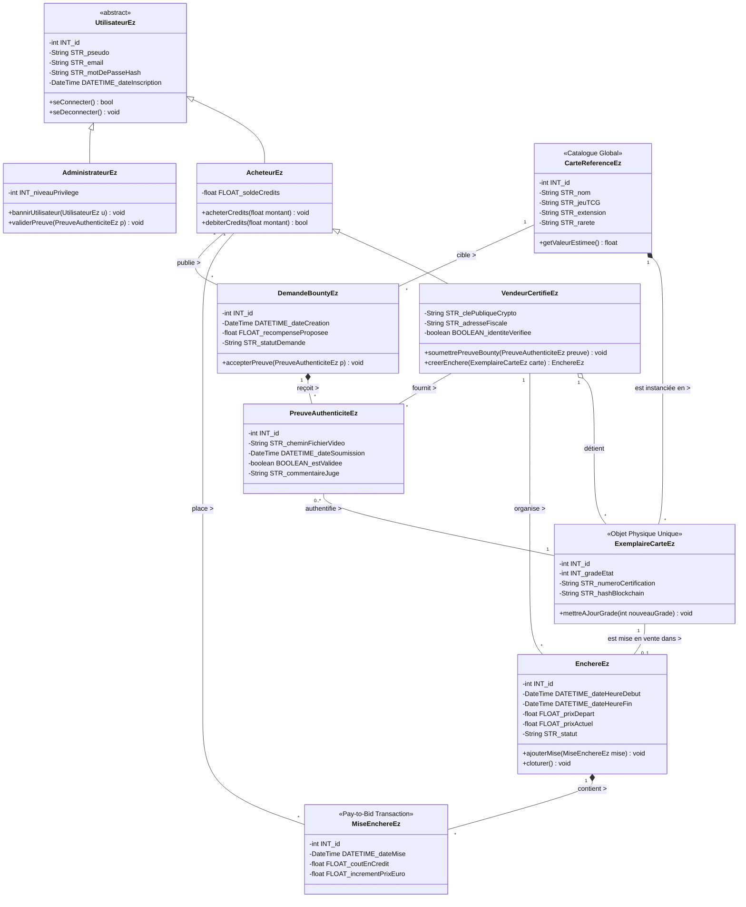

Modèle Conceptuel de Données (ACOO) - Projet PECz (Version Simple Stylée)

Auteur : Jean-Guy Mauve (revu par l'Équipe d'Architecture)
Note de conception : Application de la nomenclature "Ez" pour le style, et de la notation hongroise majuscule pour les attributs.

Ce diagramme de classes représente le modèle du domaine simplifié. Il met en évidence l'encapsulation (attributs privés -, méthodes publiques +), l'héritage, ainsi que les relations fortes (composition *--) et faibles (agrégation o-- ou association simple --).

Note technique pour GitHub : Ce diagramme utilise la syntaxe Mermaid. Il sera automatiquement rendu de manière visuelle par l'interface GitHub.

